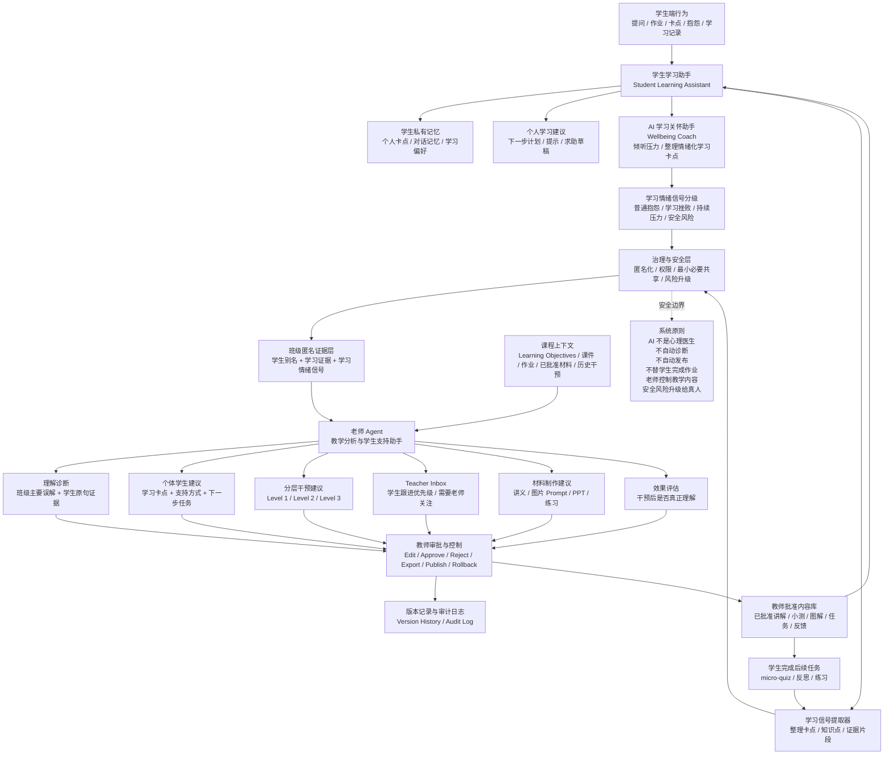

# AI School Agent Architecture

Last updated: 2026-07-02

This note is the long-term system architecture map for TeachFlow as an AI school agent system. It separates private student support, learning wellbeing check-ins, anonymised evidence, teacher approval, curriculum context, and school governance.

## Updated Mermaid Diagram

## Major Modules

- Student Learning Assistant: guides the student, explains concepts, records personal stuck points, and helps write a help request. It should not complete homework or provide final answers.
- AI 学习关怀助手 / Wellbeing Coach: lets students express learning frustration, stress, and reluctance, then turns that into learning support language. It is not a therapist and must not diagnose mental health conditions.
- Student Private Memory: private learning context for the student and system only. Teachers should not see the full raw conversation by default.
- Learning Signal Extractor: turns student questions, assignments, stuck notes, and shared check-ins into limited evidence: alias, topic, misconception type, evidence quote, confidence, learning support signal, and teacher-attention flag.
- Wellbeing Signal Agent: classifies temporary learning-state signals such as normal complaint, low confidence, sustained learning pressure, or safety-risk language. It outputs learning support signals, not diagnoses.
- Governance & Safety Layer: central gate for anonymisation, role-based access, minimum necessary sharing, teacher approval, audit logging, no automatic grading, no automatic publishing, no homework completion, and safeguarding escalation to humans when needed.
- Class Anonymised Evidence Layer: teacher-usable evidence for diagnosis. It contains aliases, learning evidence, and learning-relevant wellbeing summaries, not real identity or unrelated private content.
- Curriculum Context: learning objectives, lesson materials, homework, approved content, assessment criteria, and past interventions that keep the teacher Agent grounded in the actual course.
- Teacher Agent: helps the teacher diagnose misconceptions, plan differentiated interventions, create materials, maintain a Teacher Inbox, and evaluate intervention outcomes.
- Teacher Approval & Control: the teacher edits, approves, rejects, exports, publishes, rolls back, and reviews audit/version history.
- Teacher-Approved Content Library: official student-facing learning content should come from this layer whenever possible.
- Intervention Outcome Loop: published content leads to micro-quiz/reflection/practice, which creates new learning signals and updates the evidence layer.

## v0.1 Scope

Current v0.1/v0.3 prototype should stay focused on the teacher-controlled core:

- Teacher page, student page, and school-admin page.
- Alias-only student evidence.
- Student Check-in / AI 学习关怀助手 with `Keep private`, `Ask AI first`, and `Share learning summary with teacher`.
- Teacher-visible Student Support Profile and Teacher Inbox based on shared check-in summaries.
- Misconception diagnosis.
- Differentiated intervention.
- Teacher approval, version history, rollback, export, publish, and audit log.
- Student assignment, question, stuck-signal, and check-in submission.
- Student signals syncing into teacher teaching analysis and student support profiles.
- School-admin aggregate dashboard and class comparison.
- Local demo login with role/class boundaries.

## Future Scope

These belong to later versions after the core loop is stable:

- Richer student private memory and long-running personal agent state.
- Stronger Learning Signal Extractor with configurable evidence rules.
- Teacher Inbox with actionable queue items and dismiss/schedule/send-material actions.
- Dedicated safeguarding role, escalation workflow, and school-configured contacts before any real wellbeing deployment.
- Teacher-approved content library with searchable materials and publishing history.
- Intervention outcome evaluation after micro-quiz/reflection/practice.
- School-level pilot operations, readiness reports, and feedback records.
- Production identity, database, retention, CSRF, CSP, rate limiting, and real AI integration.

## Design Principle

AI drafts. Teachers decide.

Student agents guide learning, but do not complete work for students. The AI 学习关怀助手 supports learning frustration, but it is not a psychological diagnosis or therapy system. Teacher agents analyse evidence, but do not replace teacher judgment.
